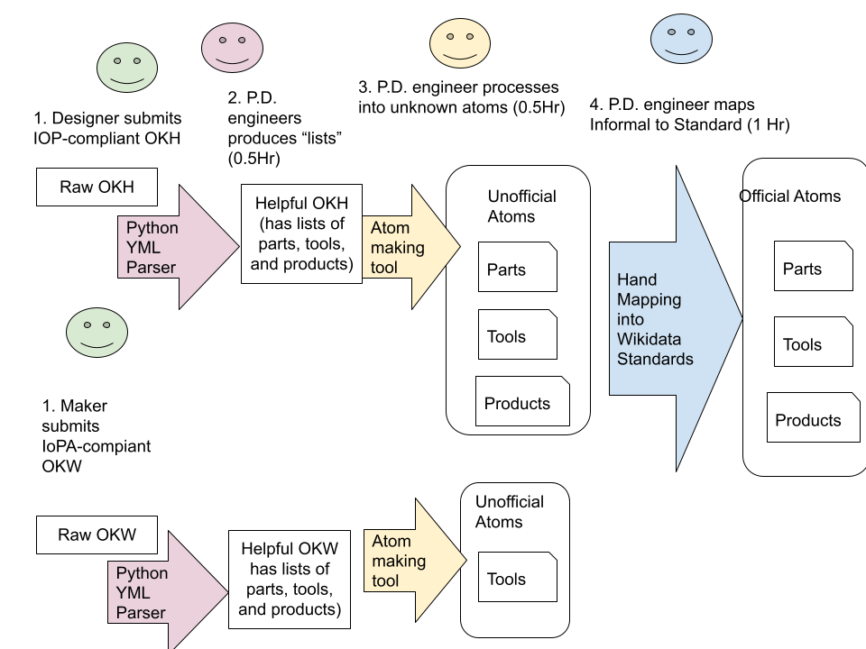

# project-data

An experimental attempt to make a CLI for supply-chain modeling for Helpful Engineering's Project Data

Click here to view the [SCIS pilot project early code walk through video](https://youtu.be/IAYBdHfAjxg).

# Installation and running

Note, `project-data` requires Python 3.10 or higher.

After cloning the library, you can install the dependencies in your global Python environment, or in a
[virtual environment](https://docs.python.org/3/library/venv.html).
It is highly recommended to use a virtual environment, as it will prevent dependency conflicts with other projects.
For more information on Python virtual environments, see the [official Python documentation](https://docs.python.org/3/library/venv.html).

## Creating a Virtual Environment with VSCode

If you are using VSCode, the [Microsoft Python extension](https://marketplace.visualstudio.com/items?itemName=ms-python.python)
can automatically configure a Python virtual environment for you. To do this, open the command palette (`Ctrl+Shift+P` or `Cmd+Shift+P`)
and search for "Python: Create Environment". Select the `Venv` option and then select the Python interpreter you want to use.
(Python 3.10 or later). This will create a virtual environment in the `.venv` folder in the root of your project. Additionally, 
if you open a VSCode terminal window, it will automatically activate the virtual environment for you.

## Creating a Virtual Environment manually

To manually create a virual environment for this project, first you need to run the `venv` module from the Python standard library.
Like virtual environments created by the VSCode extension, any VSCode terminal window you open will be automatically activated
in the virtual environment.

Execute this command from the root of your cloned project:

```
python3 -m venv .venv
```

> Note, you can create the virtual environment in whatever folder you please that doesn't conflict with a current 
> project folder. The `.venv` folder is a common convention for Python projects. The rest of this guide assumes you
> have created the virtual environment in the `.venv` folder in the root of your cloned project.

Next, you need to activate the virtual environment. The virtual environment's script directory contains a series of 
`activate` scripts for different shells. You can activate the virtual environment by running the appropriate script
for the shell you are using.

For example, if you are using Bash, you can activate the virtual environment by running:

```
.venv/Scripts/activate
```

`Activate.ps1` and `activate.bat` are also available for Powershell and Windows Command Prompt, respectively.

Finally, install the dependencies in the virtual environment by running the following command from the root of your
cloned project:

```
python3 -m pip install --editable .
```

The `--editable .` option causes `pip` to retrieve the list of dependencies from the `pyproject.toml` file and install
them in the virtual environment.

# Process description

As part of our attempt to make a usable matching process, we plan to implement the following process:



# Internal Workflow

This team has decided to work in branches, and to have at least one other person review code before it is merged into main.
